# **TylePlay**
---
TylePlay is a desktop application for tracking gaming sessions.

> Only supports tracking native PC game executable files (`.exe`). Game emulators and non-executable launchers are not supported yet.
---
 ## Screenshots
<table>
  <tr>
    <th colspan="2" align="center">Dashboard</th>
  </tr>
  <tr>
    <td align="center"></td>
    <td align="center"></td>
  </tr>

  <tr>
    <th colspan="2" align="center">Library</th>
  </tr>
  <tr>
    <td align="center">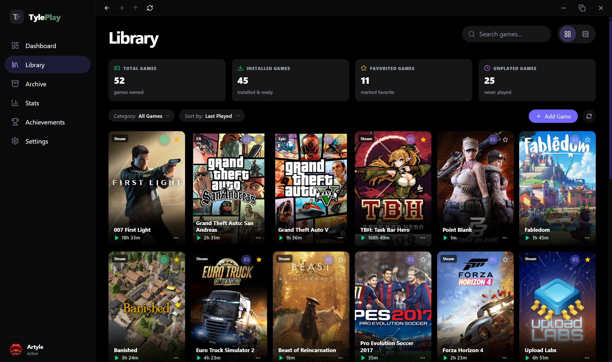</td>
    <td align="center">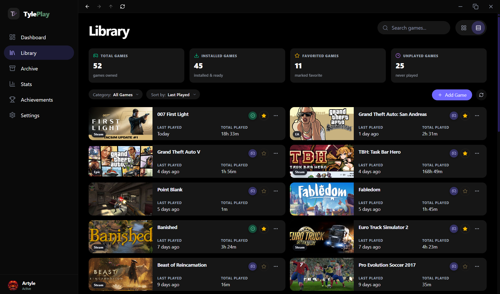</td>
  </tr>

  <tr>
    <th colspan="2" align="center">Library</th>
  </tr>
  <tr>
    <td align="center">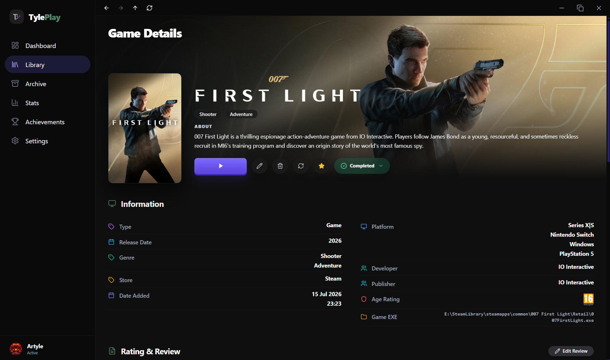</td>
    <td align="center">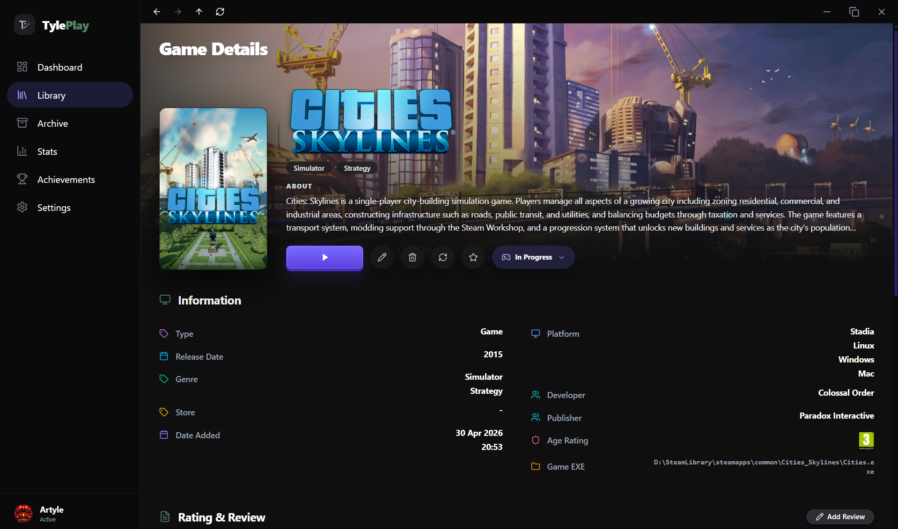</td>
  </tr>

  <tr>
    <th colspan="2" align="center">Library</th>
  </tr>
  <tr>
    <td align="center">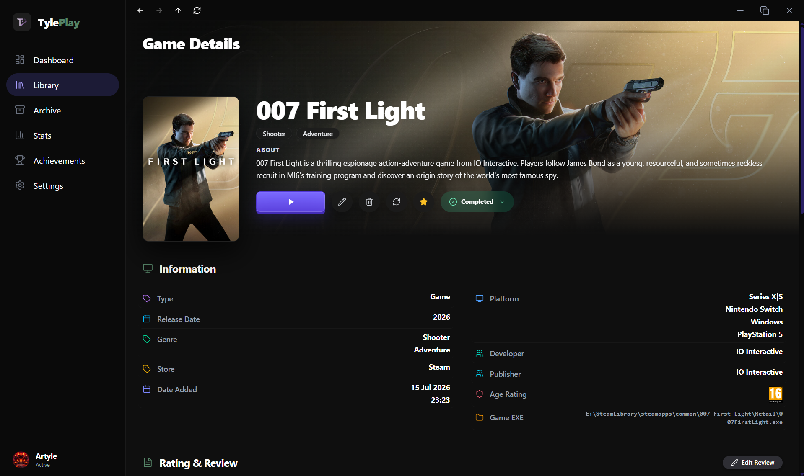</td>
    <td align="center">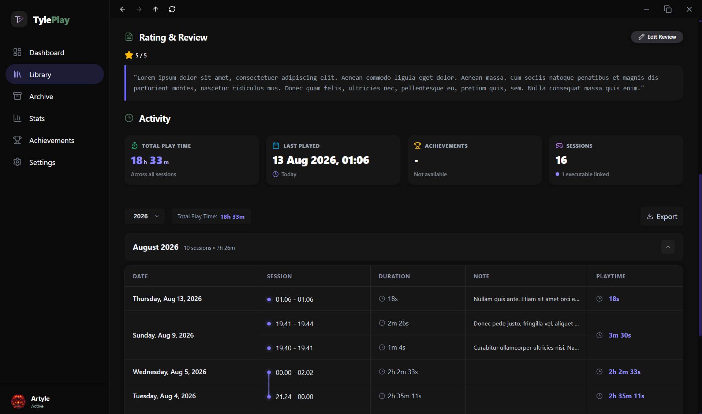</td>
  </tr>

  <tr>
    <th colspan="2" align="center">Stats</th>
  </tr>
  <tr>
    <td align="center"></td>
    <td align="center"></td>
  </tr>

  <tr>
    <th colspan="2" align="center">Stats</th>
  </tr>
  <tr>
    <td align="center">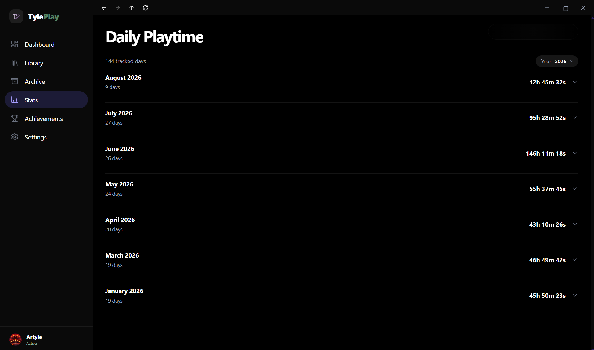</td>
    <td align="center">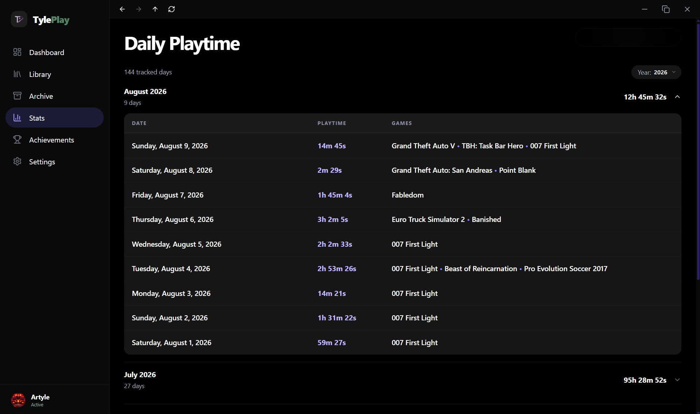</td>
  </tr>

  <tr>
    <th colspan="2" align="center">Stats</th>
  </tr>
  <tr>
    <td align="center">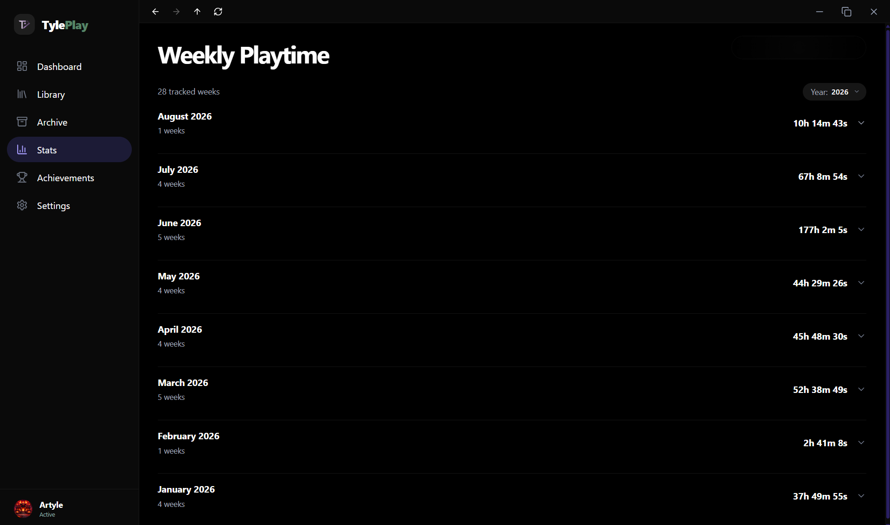</td>
    <td align="center">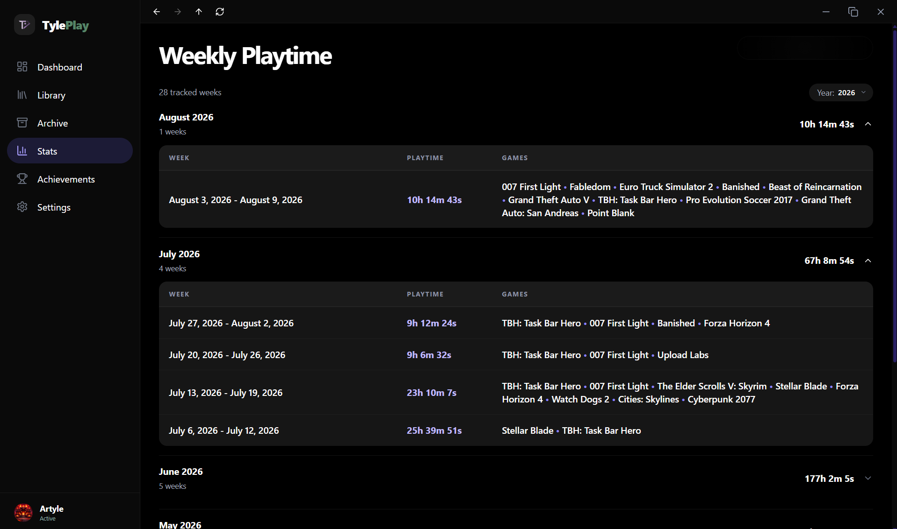</td>
  </tr>

  <tr>
    <th colspan="2" align="center">Stats</th>
  </tr>
  <tr>
    <td align="center">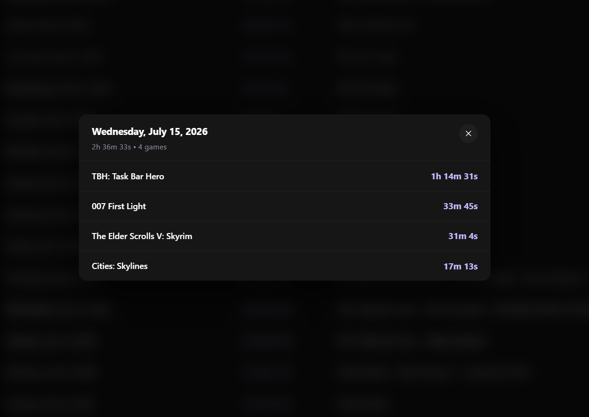</td>
    <td align="center">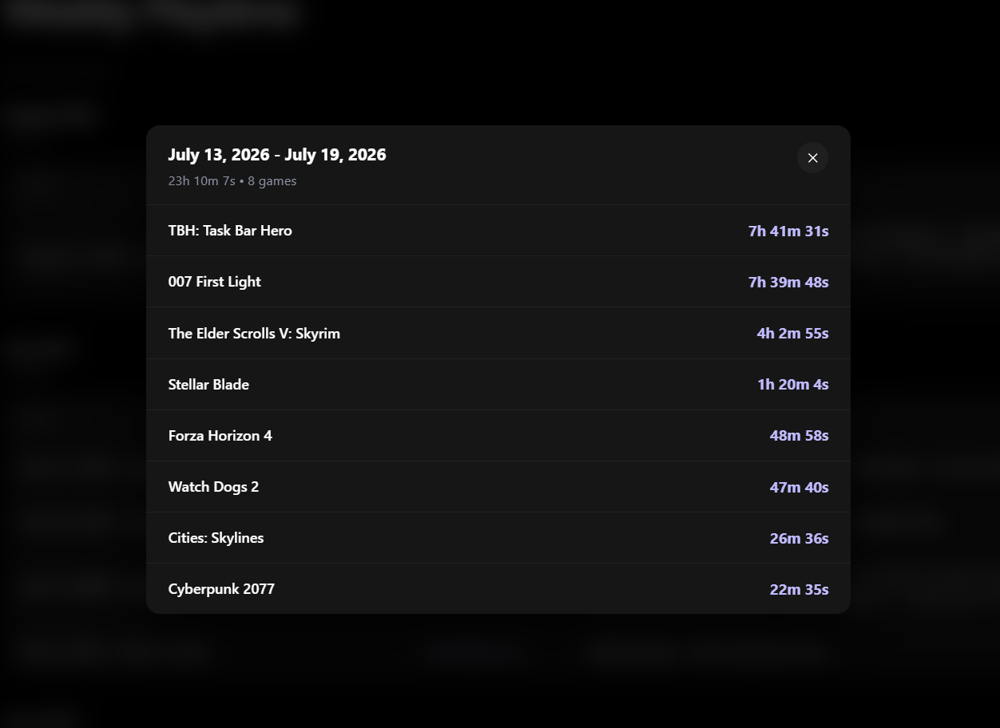</td>
  </tr>
</table>

---
**v2.3.6 (2026-08-13)**
- [X] Added game completion status system.
- [X] Added user ratings and reviews feature.
- [X] Added per-session notes logging,
- [X] Added visual session connecting lines for overnight play sessions
- [X] Improved game session table layout and visual design.
- [X] Minor bug fixes and general UI improvements.

**v2.3.5 (2026-08-11)**
- [x] First
 