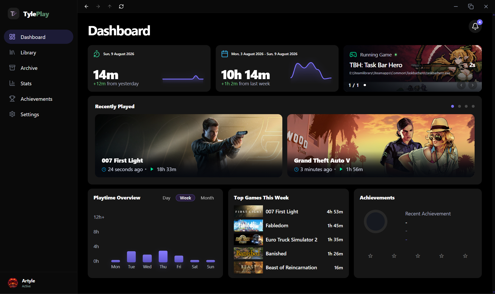
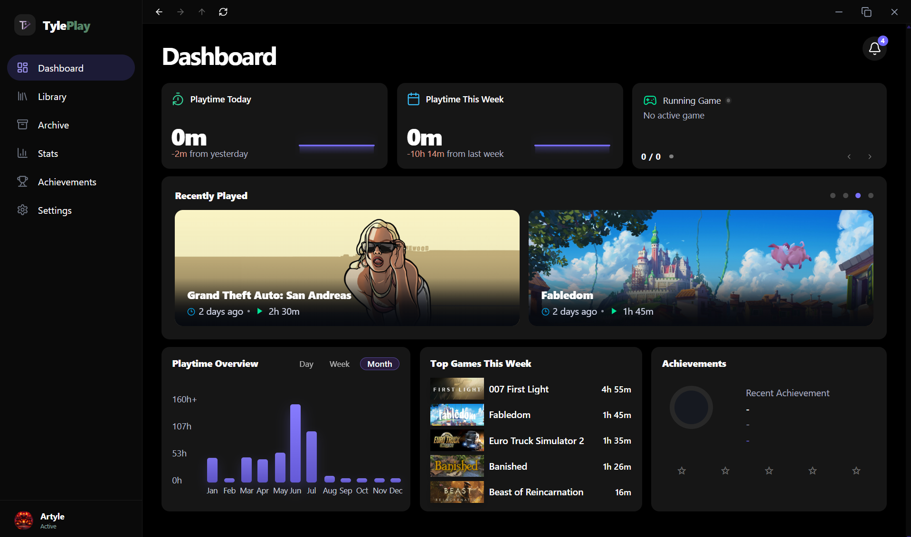
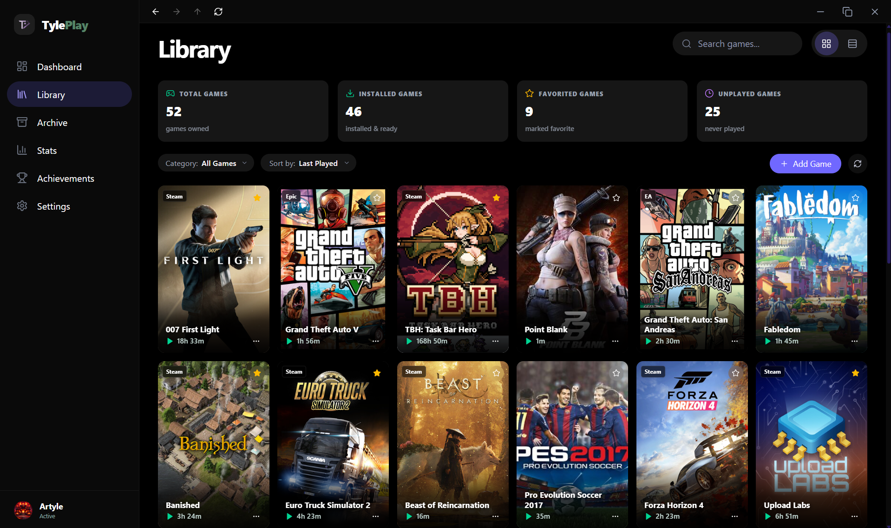
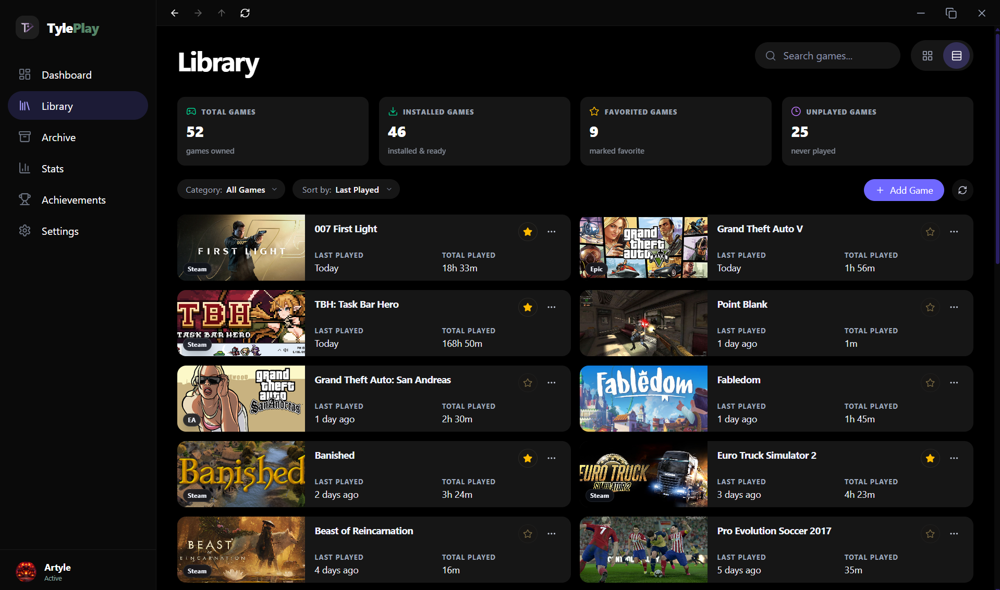
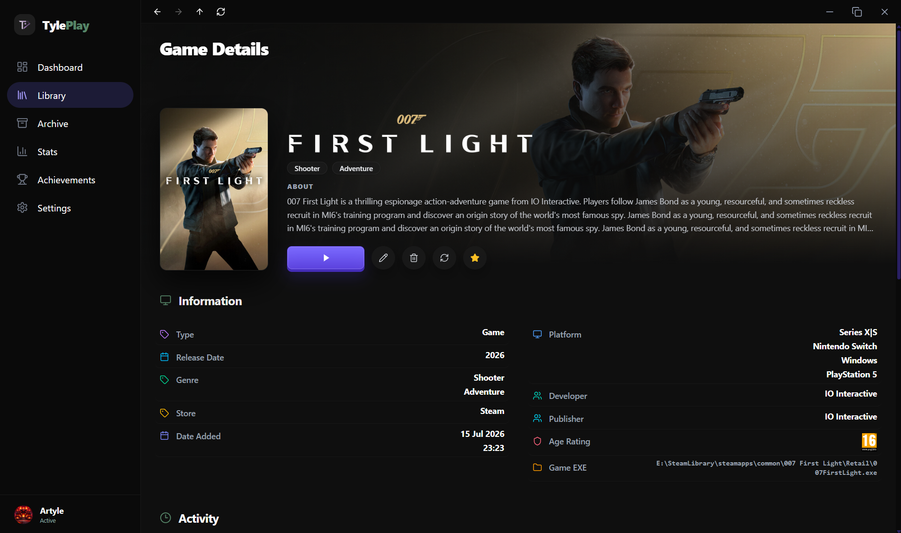
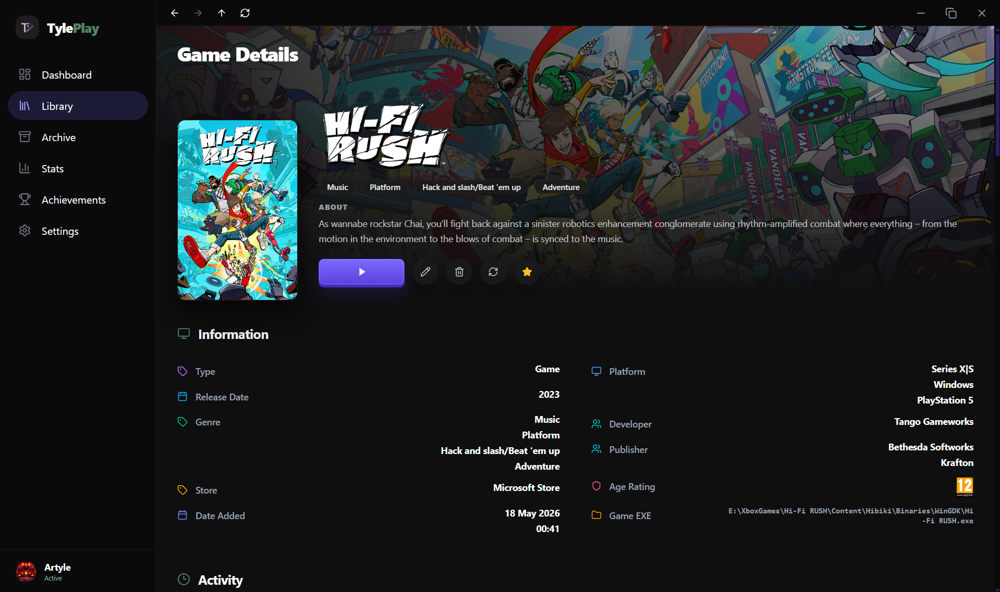
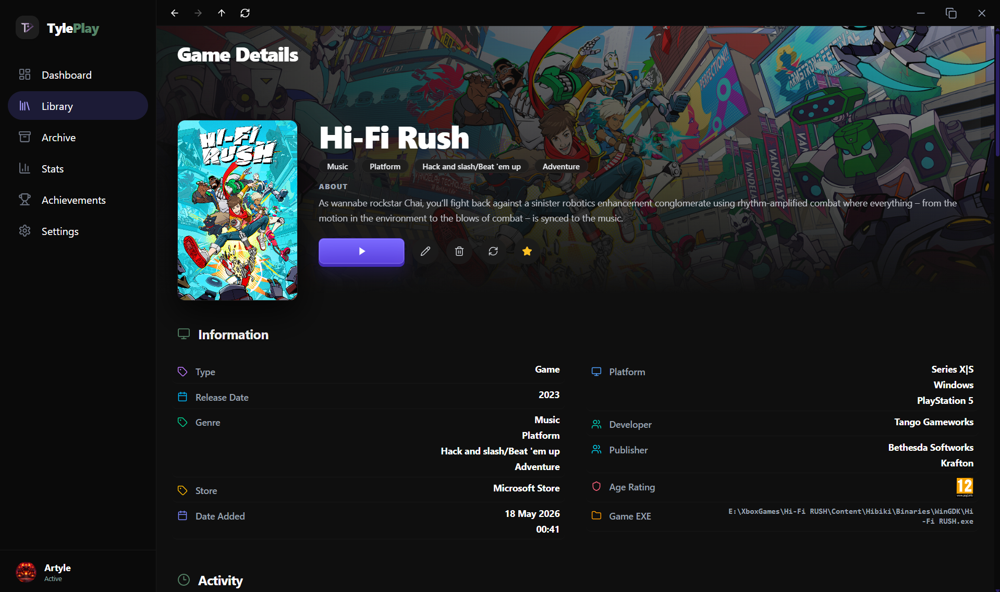
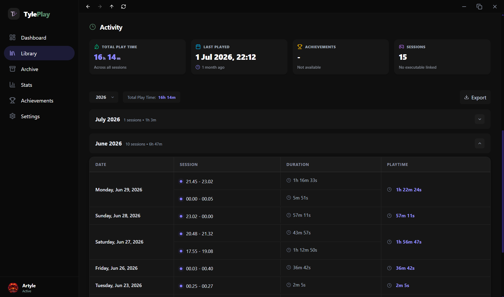
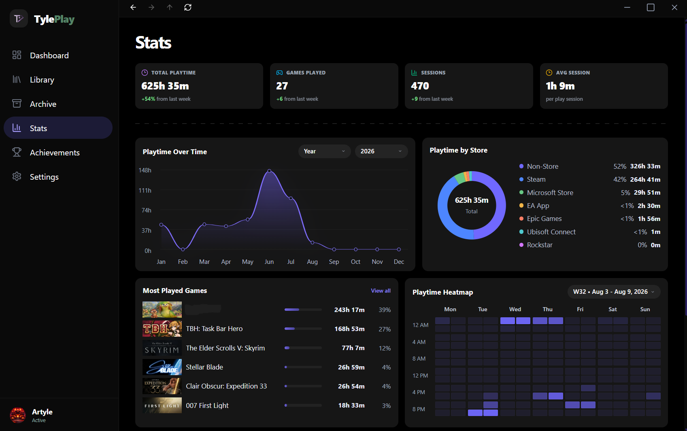
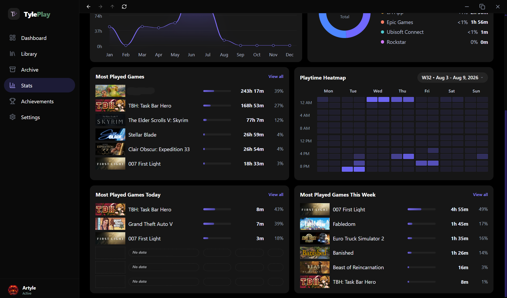

# **TylePlay**
---
TylePlay is a desktop application for tracking gaming sessions.

> Only supports tracking native PC game executable files (`.exe`). Game emulators and non-executable launchers are not supported yet.
---
 ## Screenshoot
<table>
  <tr>
    <th colspan="2" align="center">Dashboard</th>
  </tr>
  <tr>
    <td align="center"></td>
    <td align="center"></td>
  </tr>

  <tr>
    <th colspan="2" align="center">Library</th>
  </tr>
  <tr>
    <td align="center"></td>
    <td align="center"></td>
  </tr>

  <tr>
    <th colspan="2" align="center">Library</th>
  </tr>
  <tr>
    <td align="center"></td>
    <td align="center"></td>
  </tr>

  <tr>
    <th colspan="2" align="center">Library</th>
  </tr>
  <tr>
    <td align="center"></td>
    <td align="center"></td>
  </tr>

  <tr>
    <th colspan="2" align="center">Stats</th>
  </tr>
  <tr>
    <td align="center"></td>
    <td align="center"></td>
  </tr>
</table>

---
**v2.3.5 (2026-08-11)**
- [x] First
 