# **TylePlay**
---
TylePlay is a desktop application for tracking gaming sessions. All application data is stored locally.

<p align="center">
  
</p>

Database Location: ```%APPDATA%\com.artyle.tyleplay```

> Only supports tracking native PC game executable files (`.exe`). Game emulators and non-executable launchers are not supported yet.
---
 ## Screenshots
<table>
  <tr>
    <th colspan="2" align="center">Dashboard</th>
  </tr>
  <tr>
    <td align="center">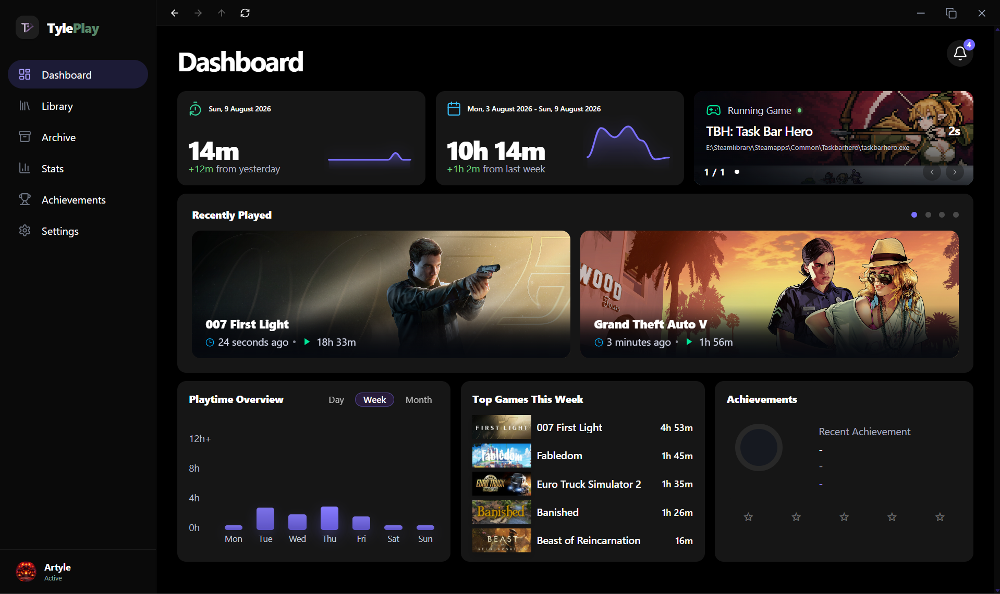</td>
    <td align="center">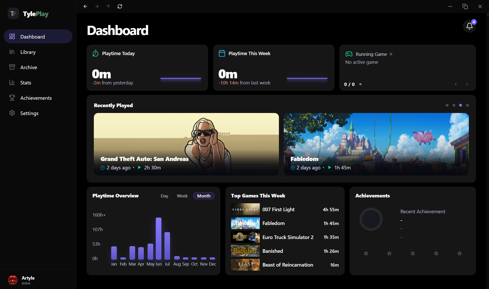</td>
  </tr>

  <tr>
    <th colspan="2" align="center">Library</th>
  </tr>
  <tr>
    <td align="center">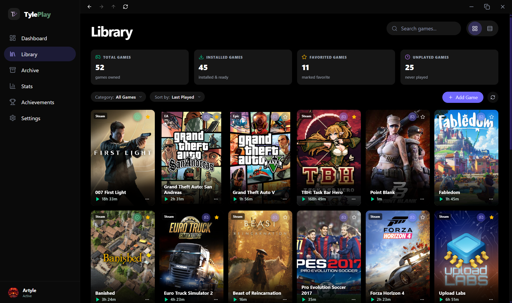</td>
    <td align="center">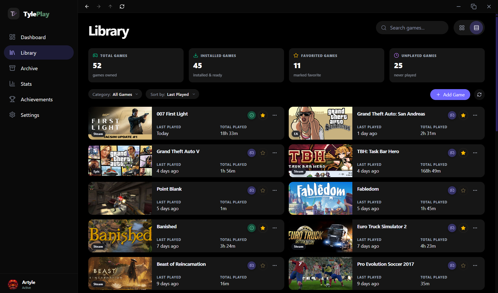</td>
  </tr>

  <tr>
    <th colspan="2" align="center">Library</th>
  </tr>
  <tr>
    <td align="center">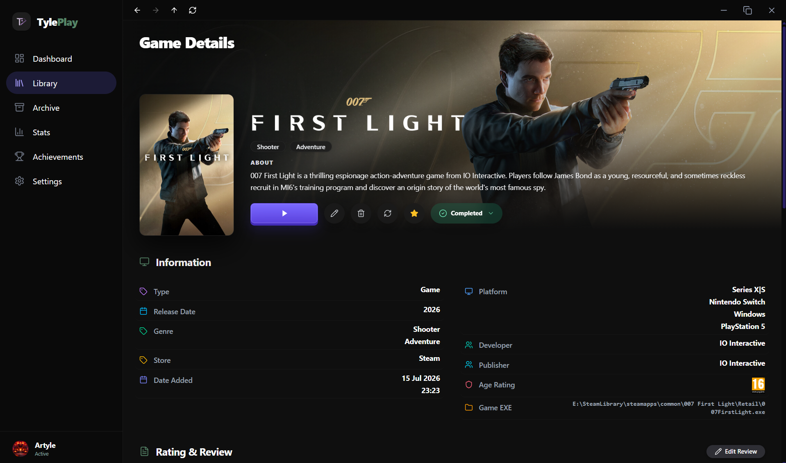</td>
    <td align="center">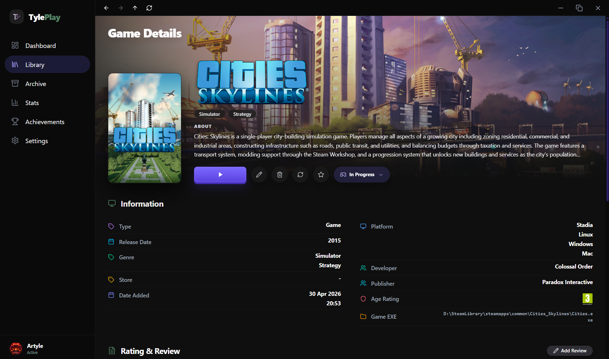</td>
  </tr>

  <tr>
    <th colspan="2" align="center">Library</th>
  </tr>
  <tr>
    <td align="center">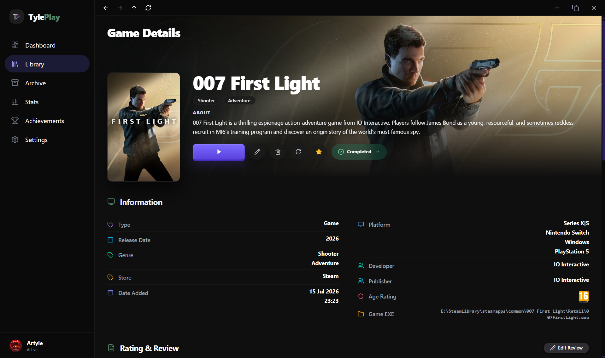</td>
    <td align="center">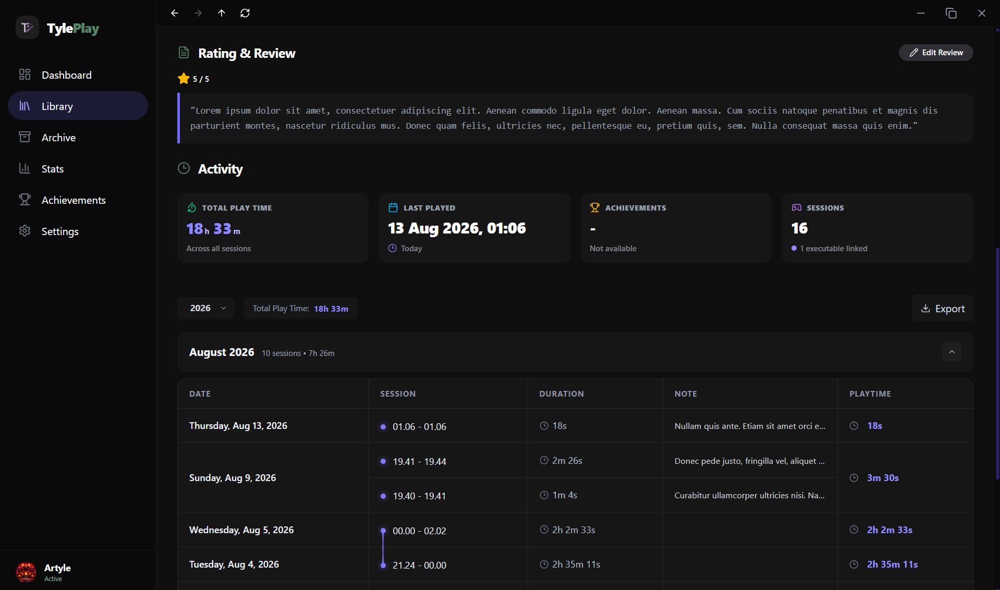</td>
  </tr>

  <tr>
    <th colspan="2" align="center">Stats</th>
  </tr>
  <tr>
    <td align="center">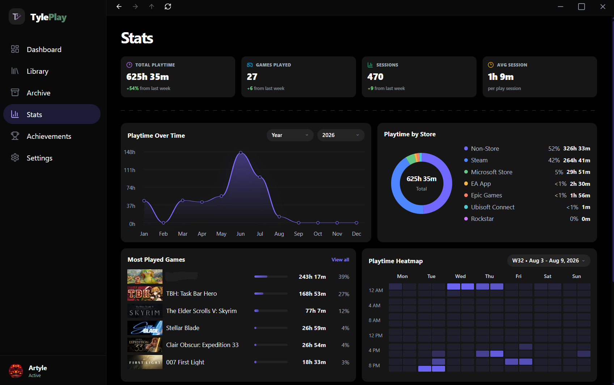</td>
    <td align="center">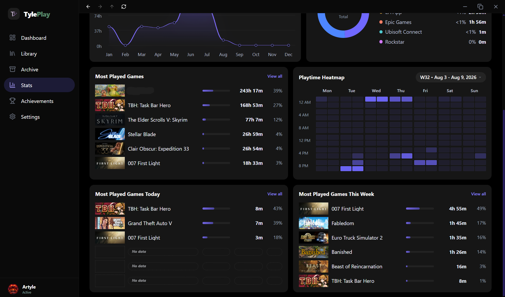</td>
  </tr>

  <tr>
    <th colspan="2" align="center">Stats</th>
  </tr>
  <tr>
    <td align="center">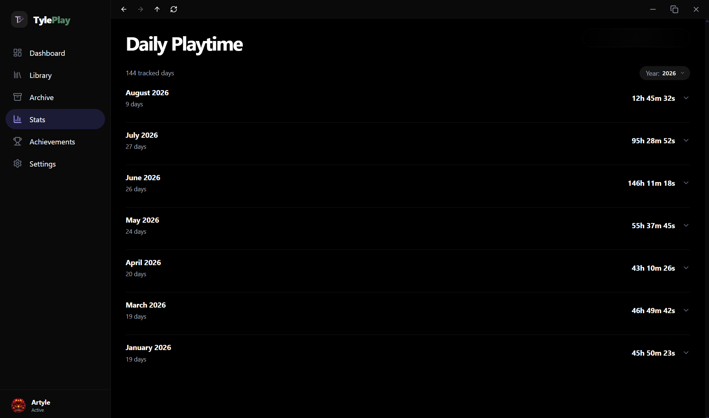</td>
    <td align="center">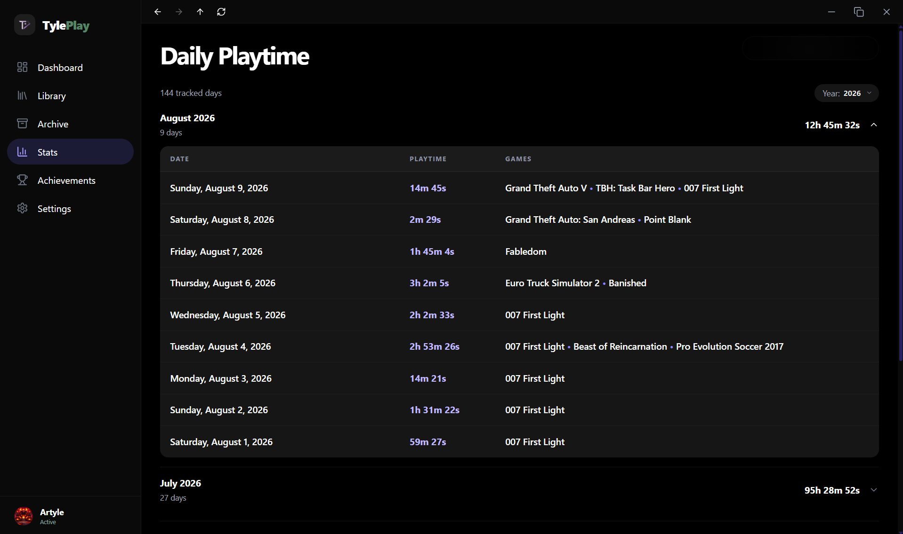</td>
  </tr>

  <tr>
    <th colspan="2" align="center">Stats</th>
  </tr>
  <tr>
    <td align="center">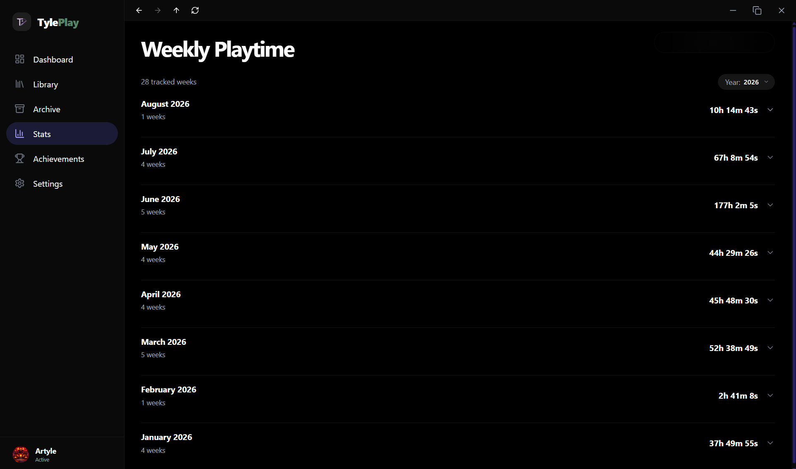</td>
    <td align="center">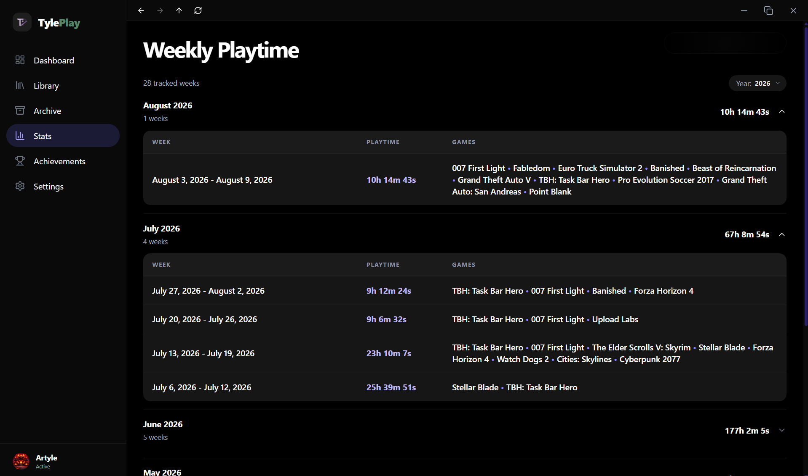</td>
  </tr>

  <tr>
    <th colspan="2" align="center">Stats</th>
  </tr>
  <tr>
    <td align="center">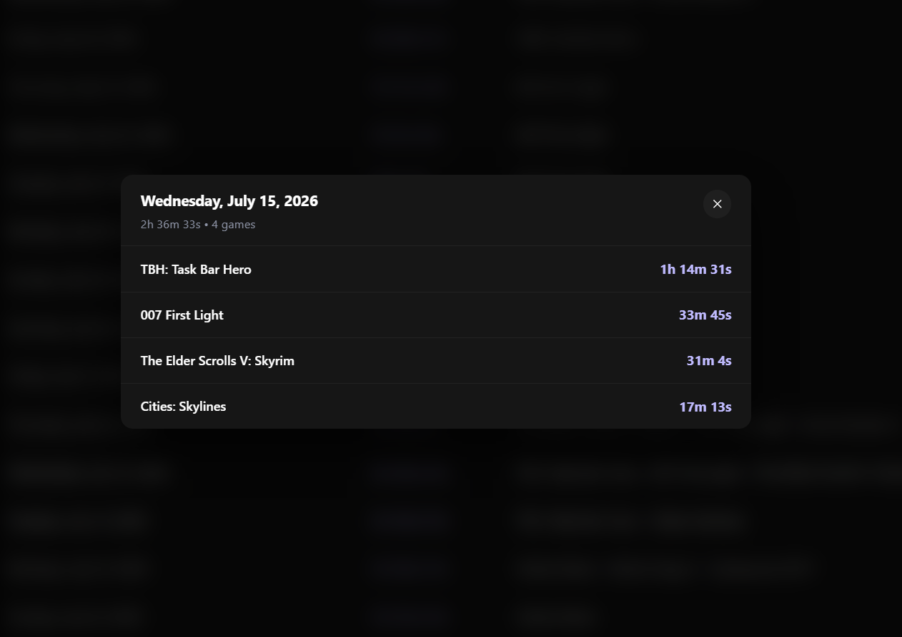</td>
    <td align="center">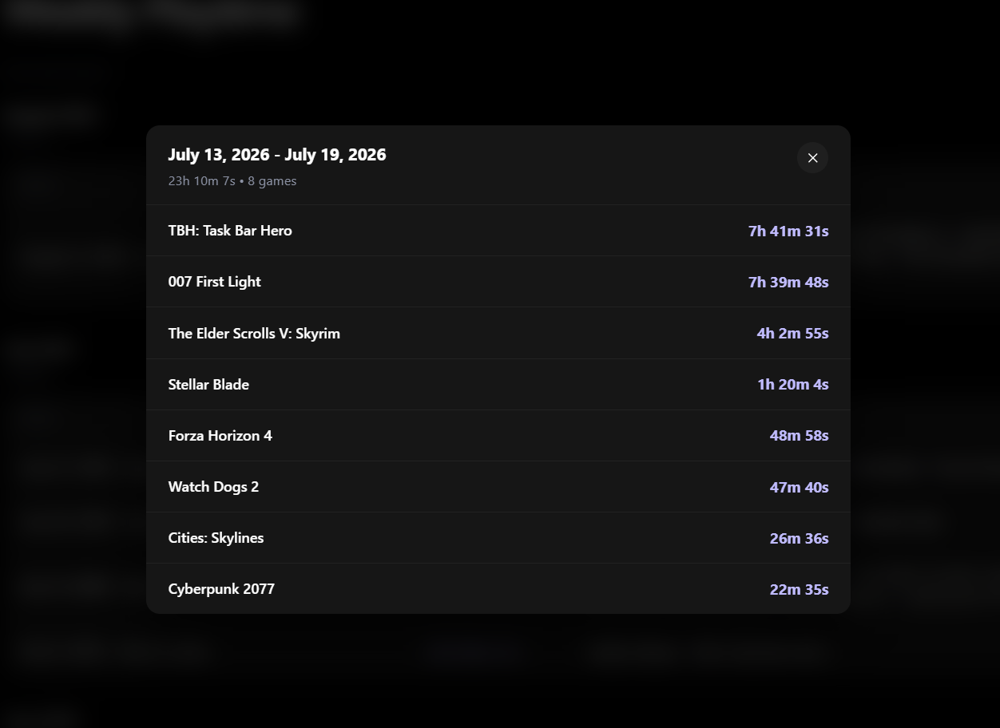</td>
  </tr>
</table>

---
**v2.3.9-1 (2026-09-29)**
- [x] Fixed running game detection, live playtime counter, and dashboard hover effect.
- [x] Added Export to CSV on Game Playtime page.

**v2.3.9 (2026-09-25)**
- [x] Migrated background polling to an event-driven reactive architecture,
- [x] Added a Poster-Only view mode on the Library page.
- [x] Fixed recent playtime disappearing on the Stats page and resolved the endless loading loop on the Weekly Playtime page.
- [x] Fixed corner gaps on Library poster cards and balanced overlay gradient presentation.
- [x] Improved UI/UX with centered spin loaders and cleaner section titles.

**v2.3.8-7 (2026-08-30)**
- [x] Added Emulator Support.
  - DuckStation, tested on v0.1-11752
  - PCSX2, tested on v2.6.3
  - RPCS3, tested on v0.0.40-19032-bc0c42b0 Alpha
  - PPSSPP, tested on v1.7.4
  - Yuzu, tested on v1730
- [x] Fixed Edit and Delete buttons not working on the Library page.
- [x] Fixed loading behavior when syncing game details on the Game Details page.
- [x] Fixed an issue preventing emulator game information from being saved.
- [x] Improved the Archive and Restore game process.

**v2.3.7 (2026-08-18)**
- [x] Added Database Export & Import functionality.
- [x] Added toast notifications when a game starts or ends.
- [x] Added CSV Export buttons to the Daily Playtime and Weekly Playtime pages.
- [x] Added Automatic Daily Backup at 11:00 PM. Backups are stored in ```...\Documents\TylePlay\Backup```.
- [x] Fixed Pagination Limits to prevent excessive page buttons on long lists
- [x] Fixed the Hours-Only Time Format to be properly applied throughout the application.

**v2.3.6 (2026-08-13)**
- [X] Added game completion status system.
- [X] Added user ratings and reviews feature.
- [X] Added per-session notes logging,
- [X] Added visual session connecting lines for overnight play sessions
- [X] Improved game session table layout and visual design.
- [X] Minor bug fixes and general UI improvements.

**v2.3.5 (2026-08-11)**
- [x] First
 