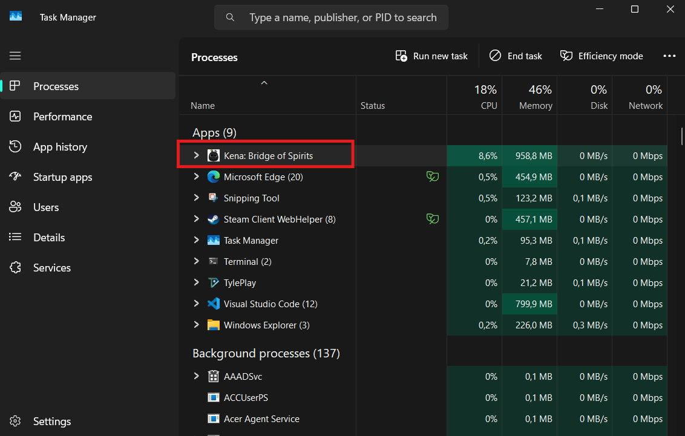
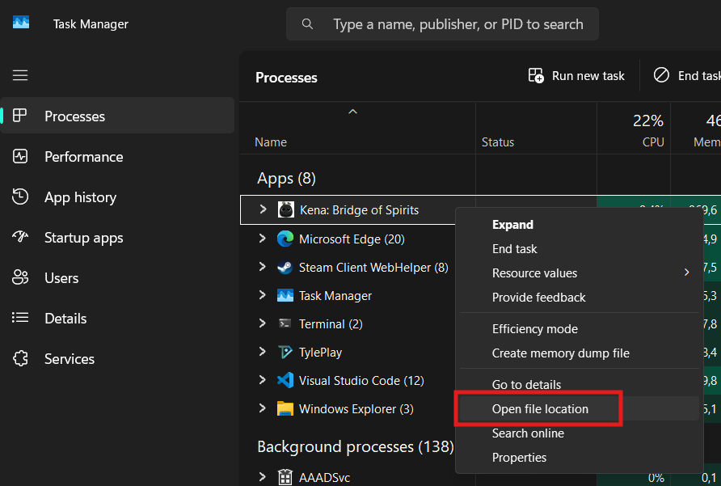
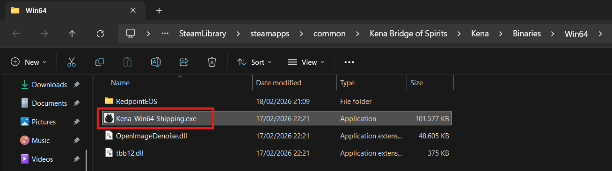

### HOW TO ADD A GAME EXECUTABLE

If you are not sure which `.exe` file to choose when adding a game, follow these steps:

1. Launch the game as usual, either from its own launcher or from the store launcher.
2. Once the game is running, return to the desktop by pressing *Windows + D* or *Alt + Tab*.
3. If the game cannot be minimized, run it in *Windowed Mode*.
4. Open Task Manager by *right-clicking* an empty area of the taskbar and selecting *Task Manager*, or by searching for it in Windows.
5. In the *Processes* tab, find the game process. 
6. *Right-click* the process and select *Open file location*. 
7. That is the `.exe` file you need to select. 

**Note:** If you cannot select the game `.exe` file or do not have permission to access it, such as with some games from the Xbox Store, you can simply copy and paste the full `.exe` path instead.
